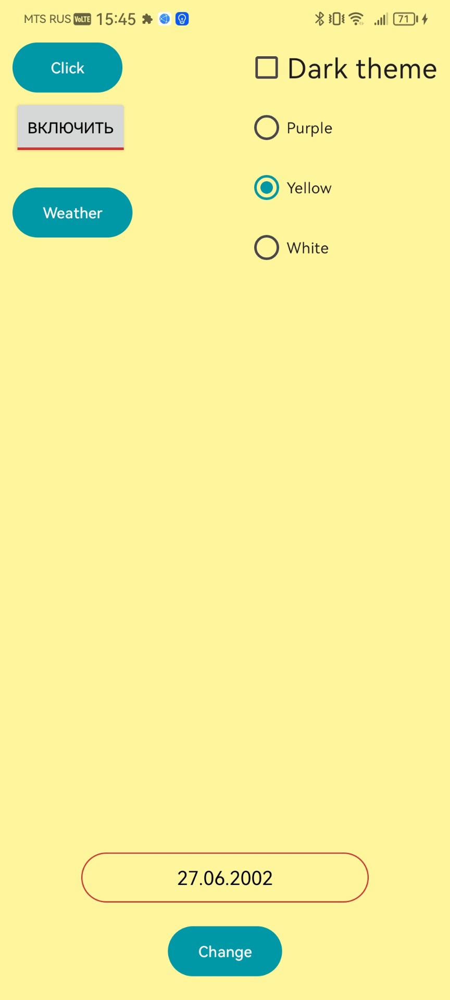
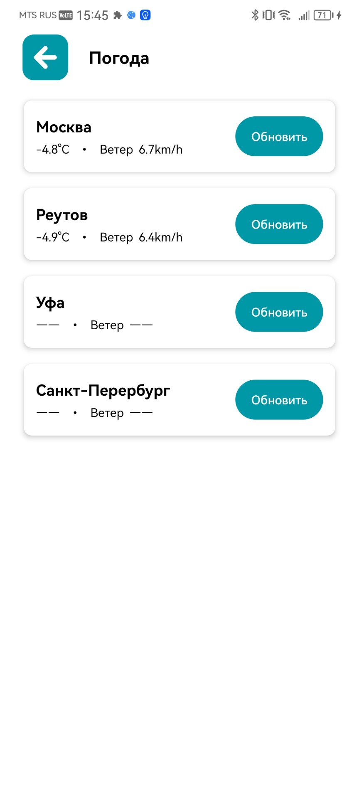
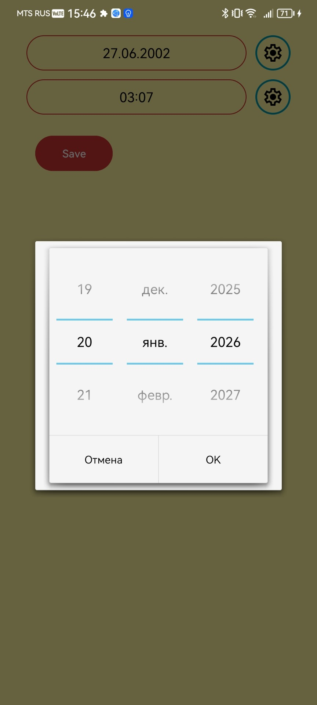

# WeatherApp 🌦️ (Kotlin / XML)

Android-приложение погоды на Kotlin. Проект сделан как портфолио: показывает **работу с сетью (Retrofit), навигацию между экранами, настройки темы и сохранение пользовательских предпочтений**.

> Репозиторий: https://github.com/XataBq/WeatherApp

---

## ✨ Возможности
- Запрос погоды по **4 городам** через API
- Сетевой слой на **Retrofit**
- Переходы между экранами (navigation)
- **Light/Dark theme** + кастомизация UI
- Сохранение настроек в **SharedPreferences**
- Смена `background` в зависимости от выбранной темы
- Кастомная заставка (splash)

---

## 🧱 Архитектура
- Разделение слоёв: UI / network / storage (preferences)
- Единый источник правды для настроек темы
- Обработка загрузки/ошибок

---

## 🧰 Технологии
- Kotlin
- Android Views (XML)
- Retrofit
- SharedPreferences

---

## 📸 Скриншоты
| Главный экран | Погода | Дата рождения |
|---|---|---|
|  |  |  |

---

## ▶️ Запуск проекта
1. `git clone https://github.com/XataBq/WeatherApp`
2. Открыть в Android Studio

---

## 🗺️ Roadmap (план улучшений)
- [ ] Добавить кэширование (Room) для последнего ответа
- [ ] Вынести настройки темы в DataStore
- [ ] Добавить тесты для маппинга/логики отображения
- [ ] Перевести часть UI на Compose (опционально)
